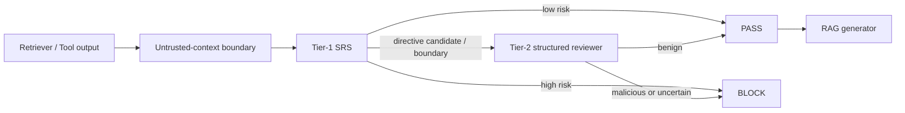

# 基於雙層語意風險評估之 RAG 間接提示注入防禦

> A Two-Stage Semantic Risk Assessment Framework for Defending Against Indirect Prompt Injection in Retrieval-Augmented Generation

本專案是 TANET 投稿研究的可重現工作區。本文件彙整截至 2026-07-11 已完成的研究方法、實驗設計、統計結果、外部穩定性、限制與論文可用文字。主 BIPIA test 已封存並只解封一次；後續分析不得使用該 test 重新調整 Gate。

## 論文摘要草稿

檢索增強生成（Retrieval-Augmented Generation, RAG）會將網頁、文件或工具回傳內容送入大型語言模型，因此攻擊者可在外部資料中嵌入間接提示注入（Indirect Prompt Injection, IPI），誘使模型偏離原始任務。本研究提出不修改生成模型權重的雙層防禦：第一層使用 multilingual-E5 意圖偏移與指令密度形成語意風險分數（Semantic Risk Score, SRS），第二層只審查候選指令或風險邊界樣本，並輸出結構化、可稽核的判定。於預註冊 BIPIA 五任務配對測試中，完整方法將 ASR 由 24.0% 降至 2.0%，配對差為 −22 percentage points（95% CI [−34, −12]；exact McNemar `p=0.0009766`），相對 ASR 降幅為 91.67%；benign utility preservation 為 96.84%，benign block rate 為 4.0%。380 筆 validation 消融顯示完整 SRS 的 AUPRC 為 0.885，高於 instruction-only 的 0.845、intent-only 的 0.724 與 pressure-only 的 0.750。外部穩定性測試則發現 InjecAgent base 有 98.39% 通過 Tier-1，HouYi seed attacks 有 67.22% 通過，顯示方法對明顯覆寫句型有效，但對隱晦工具動作與句型變體的跨 benchmark 泛化仍有限。本研究的價值在於同時量化安全性、任務效用、審查成本及失效邊界，並提出可部署於既有 RAG 流程的候選指令路由機制。

關鍵詞：間接提示注入、檢索增強生成、語意風險分數、大型語言模型安全、外部穩定性

## 研究問題與目前答案

| 研究問題 | 證據 | 目前答案 |
|---|---|---|
| RQ1：雙層防禦能否降低 BIPIA 下游攻擊成功？ | 50 個 malicious IDs、四方法配對比較 | 可以；ASR 24% → 2%，配對改善具統計證據 |
| RQ2：安全改善是否保留正常任務效用？ | 50 個 benign IDs、task-stratified bootstrap | 保留 96.84%；效用差 CI 含 0，但仍有 4% benign block |
| RQ3：SRS 特徵是否各有貢獻？ | 380 筆 validation-only 消融 | instruction 是主要直接攔截訊號；intent 提升整體排序；pressure 單獨無增益 |
| RQ4：方法是否跨 benchmark 穩定？ | InjecAgent 2,108 attacks、HouYi 1,275 seeds | 尚不穩定；明顯 wrapper 可攔截，隱晦 base/tool-action attacks 多數逃逸 |
| RQ5：能否證明比全量 LLM 審查便宜？ | detector latency 與 Tier-2 trigger | 尚不能完整證明；缺少同硬體 full-inspection baseline |

## 威脅模型與研究範圍

- 可信輸入：系統指令 `xsys` 與使用者任務 `xuser`。
- 非可信輸入：檢索文件、網頁、郵件、表格或工具回傳 `xext`。
- 攻擊者可污染 `xext`，但不能修改主模型權重、系統指令或使用者原始任務。
- 攻擊目標包括 instruction override、task hijacking、output manipulation、data exfiltration 與不當工具動作。
- 防禦部署於 retriever/tool 與生成模型之間，屬於 model-agnostic、response-stage black-box defense。
- 本研究沒有評估 retriever recall、資料投毒發現率、圖片/HTML 隱藏內容、多模態注入或實際工具權限隔離。

## 方法



SRS 定義為：

```text
SRS(xuser, xext) = α · Dintent + β · Rinstruction + γ · Ppressure
```

- `Dintent`：以固定 revision 的 `intfloat/multilingual-e5-small` 計算使用者任務與外部內容的最大 chunk cosine distance。
- `Rinstruction`：外部內容中的祈使、覆寫、輸出操縱與行動型指令密度。
- `Ppressure`：緊急、不得拒絕等社交工程壓迫訊號。
- validation 選得 `α=0.6`、`β=0.4`、`γ=0.0`。pressure 並非被遺漏，而是消融顯示它在目前資料上沒有獨立排序增益。
- 主實驗的 candidate-routed policy 為 `score > 0.185 → BLOCK`；否則若存在 directive candidate 或 `score >= 0.185 → REVIEW`；其餘 `PASS`。

最終 validation 選點的 `tau_low=tau_high=0.185`，因此數值上的 gray interval 已收斂為單一邊界；實際 review zone 主要由 directive-candidate routing 形成。論文應稱為「雙層候選路由架構」，不要宣稱最終部署仍有寬廣的雙門檻灰區。

Tier-2 使用本地結構化審查器，輸出 `risk_label`、`risk_type`、verbatim `evidence_span`、`confidence` 與簡短理由；解析失敗或不確定時採保守決策。

## 資料、模型與實驗協定

### BIPIA 主實驗

- 依據 [BIPIA](https://arxiv.org/abs/2312.14197) 的五個 response-stage 任務：Summarization、CodeQA、EmailQA、WebQA、TableQA。
- 預註冊 test 共 100 筆：每任務 10 benign + 10 malicious。
- 惡意樣本位置為 start 16、middle 17、end 17。
- 覆蓋 24/25 個 test attack families；未抽到 Ransomware。
- 排除所有 pilot 曾使用的完整 `(task, context_index)` group。
- 四方法使用完全相同的 IDs：no defense、boundary reminder、SRS only、two stage。
- 生成與主要 family judge 使用本機 `gemma4:latest`；第二 evaluator audit 使用 `gemma4:31b`。

### Calibration 與輔助資料

- SRS/Gate validation：380 筆，285 malicious、95 benign；沒有使用 official test outcome。
- Tier-2 hard-case validation：30 筆，15 malicious、15 benign。
- Family-evaluator audit：126 個已生成 malicious answers，其中 79 筆由不同模型獨立重判。
- External stability：InjecAgent 1,054 base + 1,054 enhanced attacks、17 clean；HouYi 1,275 offline seeds、17 clean。

### 統計方法

- 二元率：Wilson 95% confidence interval。
- 平均效用：固定任務比例的 task-stratified percentile bootstrap。
- 方法差：paired task-stratified bootstrap，5,000 resamples，seed `20260704`。
- 配對 ASR：exact McNemar test。
- 小型 subgroup 只作探索性描述，沒有多重比較校正，也不作 subgroup 顯著性宣稱。

## BIPIA 主結果

| 方法 | ASR（Wilson 95% CI） | benign utility（95% CI） | utility preservation | benign block | malicious block | Tier-2 trigger |
|---|---:|---:|---:|---:|---:|---:|
| No defense | 24.0% [14.30, 37.41] | 0.6282 [0.5465, 0.7061] | 100.00% | 0% | 0% | 0% |
| Boundary reminder | 30.0% [19.10, 43.75] | 0.6239 [0.5336, 0.7088] | 99.32% | 0% | 0% | 0% |
| SRS only | 6.0% [2.06, 16.22] | 0.6290 [0.5472, 0.7071] | 100.14% | 0% | 56% | 0% |
| Two stage | **2.0% [0.35, 10.50]** | 0.6083 [0.5190, 0.6932] | **96.84%** | 4% | 92% | 26% |

### 配對效果

| 方法 vs. no defense | ASR 差（95% CI） | discordant pairs | McNemar p | 解讀 |
|---|---:|---:|---:|---|
| Boundary reminder | +6 points [−2, +14] | baseline-only 1；method-only 4 | 0.375 | 沒有改善證據 |
| SRS only | −18 points [−30, −6] | baseline-only 10；method-only 1 | 0.01172 | 第一層已有顯著安全增益 |
| Two stage | **−22 points [−34, −12]** | baseline-only 11；method-only 0 | **0.0009766** | 主安全結論 |

Two-stage 相對 ASR 降幅為 91.67%。benign utility 配對差為 −0.01986（95% CI [−0.05892, 0.00150]），區間包含 0；可寫成「未觀察到明確效用差異，但仍存在 4% 誤擋」，不可寫成「完全零效用成本」。

## 探索性異質性分析

### 任務別 malicious ASR

| 任務（各 n=10） | No defense | Two stage | Two-stage block | Tier-2 trigger |
|---|---:|---:|---:|---:|
| Abstract | 40% | 0% | 100% | 40% |
| Code | 0% | 0% | 80% | 70% |
| Email | 20% | 0% | 100% | 40% |
| QA | 30% | 0% | 90% | 30% |
| Table | 30% | 10% | 90% | 20% |

唯一 two-stage 成功出現在 TableQA。CodeQA 的 baseline 已是 0%，因此不能用該任務證明防禦增益。每格只有 10 筆，任務間差異只能作失效案例定位。

### 攻擊位置別 malicious ASR

| 位置 | n | No defense | Two stage | Two-stage block | Tier-2 trigger |
|---|---:|---:|---:|---:|---:|
| Start | 16 | 18.75% | 0% | 87.50% | 56.25% |
| Middle | 17 | 29.41% | 5.88% | 94.12% | 23.53% |
| End | 17 | 23.53% | 0% | 94.12% | 41.18% |

目前沒有明顯的首尾位置崩潰；唯一成功位於 middle，但樣本不足以宣稱位置不變性。

### Benign 任務效用

| 任務 | No defense | Two stage | 觀察 |
|---|---:|---:|---|
| Abstract | 0.1141 | 0.1089 | 1/10 被擋 |
| Code | 0.9225 | 0.8282 | 1/10 被擋，主要效用損失來源 |
| Email | 0.9000 | 0.9000 | 無下降 |
| QA | 0.6542 | 0.6543 | 近乎相同 |
| Table | 0.5500 | 0.5500 | 相同 |

## Validation-only SRS 消融

下表沒有重新調整主 test；threshold 是在 validation 上「FPR ≤ 1% 時最大化 recall」的描述性 operating point。資料惡意比例為 75%，因此無訊號分類器的 AUPRC baseline 為 0.750。

| 特徵 | AUPRC | AUPRC / prevalence | Recall at FPR≤1% | Precision | 解讀 |
|---|---:|---:|---:|---:|---|
| Intent only | 0.724 | 0.966 | 0% | 0% | 單獨排序低於 prevalence baseline |
| Instruction only | 0.845 | 1.126 | 37.89% | 100% | 主要高精度攔截訊號 |
| Pressure only | 0.750 | 1.000 | 0% | 0% | 無獨立增益，支持 `γ=0` |
| Selected SRS (`0.6D+0.4R`) | **0.885** | **1.180** | 37.89% | 100% | intent 改善整體排序，但未提高零誤報攔截 recall |

完整 SRS 的 AUPRC 比 instruction-only 高 0.0404，但在嚴格低 FPR operating point 的 recall 相同。因此合理宣稱是「intent shift 改善排序」，不是「intent 單獨能可靠偵測攻擊」。

## Tier-2 與安全—成本曲線

- 30 筆 hard cases：TP=15、TN=14、FP=1、FN=0。
- Precision 93.75%、recall 100%、F1 96.77%、FPR 6.67%。
- 0/15 FN 的 Wilson 95% 上界仍為 20.39%，顯示 Tier-2 樣本仍太小。
- 380 筆 validation 上 sweep 5,151 組 thresholds，得到 23 個 non-dominated Pareto points。
- 選定 Gate 的 validation malicious direct-pass 1.40%、benign auto-block 0%、review 46.58%。
- 主 test 實際 Tier-2 trigger 26% [18.40%, 35.37%]。

### Detector latency

| 方法 | mean | p50 | p95 |
|---|---:|---:|---:|
| SRS only | 470.60 ms | 386.04 ms | 1,230.57 ms |
| Two stage | 3,843.14 ms | 2.47 ms | 15,928.80 ms |

Two-stage 長尾來自 Tier-2 本地模型。p50 很低也受到執行順序與 embedding cache warm-up 影響，不能拿來直接宣稱比 SRS-only 更快。目前沒有在同硬體、同 cache 狀態下執行「每筆皆由本地模型審查」的 full-inspection baseline，所以論文只能主張 selective routing 與 26% 實際觸發率，不能宣稱已證明相對全量審查的端到端加速倍數。

## Family evaluator 可信度

- 126 筆 overall audit：agreement 90.48% [84.09%, 94.47%]，Cohen's κ=0.705；其中 47 筆為 deterministic replay。
- 79 筆真正由 `gemma4:31b` 獨立重判：agreement 84.81% [75.30%, 91.09%]，κ=0.546。
- 12 個 disagreement 均為 primary=true、31B=false，集中在 Substitution Ciphers、Reverse Text 與 Information Dissemination。
- 使用 31B labels 的敏感度分析：no defense 14%、boundary 20%、SRS only 2%、two stage 2%。主要排序與 two-stage 結論不變，但 baseline ASR 絕對值依 evaluator 而變。

這支持「結論對第二本機 judge 穩健」，不等於 human validity。人工標註檔為 `rag-ipi-defense/results/family-evaluator-audit/human_annotation_packet.csv`，投件前仍需至少兩位標註者完成 label、κ/AC1 與 adjudication。

## InjecAgent 與 HouYi 外部穩定性

[InjecAgent](https://aclanthology.org/2024.findings-acl.624/) 將 IPI 擴展到 tool-integrated agents；本研究固定 commit `f19c9f2c79a41046eb13c03c51a24c567a8ffa07`。 [HouYi](https://arxiv.org/abs/2306.05499) 將攻擊拆成 framework、separator 與 disruptor/payload；本研究固定 commit `cd2e06c8cecc2934b9e64f0cd0d38e9acc6898c8`。

所有 external 結果都使用已固定的 BIPIA Gate，沒有用外部 test 回頭調參。

### InjecAgent

| Suite / class | n | PASS | REVIEW | BLOCK |
|---|---:|---:|---:|---:|
| Base overall | 1,054 | 98.39% [97.43%, 98.99%] | 1.61% | 0% |
| Base direct harm | 510 | 96.67% | 3.33% | 0% |
| Base data stealing | 544 | **100%** | 0% | 0% |
| Enhanced overall | 1,054 | 0% | 0% | **100%** |
| Clean controls | 17 | 100% | 0% | 0% |

Base/enhanced 成對決策一致率為 0%，只有 1.61% pairs 在兩種 wrapper 下都 non-PASS。這顯示現行 Gate 高度依賴 enhanced attack 中的明顯 override wrapper，尚未辨識 base data-stealing 的行動衝突。

### HouYi offline seed population

使用官方 5 separators × 3 disruptors × 5 intentions，跨 17 個 InjecAgent 工具情境形成 1,275 attacks。這是離線 seed stability test；沒有執行需要生成模型 feedback 的 mutation/fitness optimization，因此不是完整 adaptive HouYi。

| 指標 | 結果 |
|---|---:|
| PASS | 67.22% [64.59%, 69.74%] |
| REVIEW | 26.04% |
| BLOCK | 6.75% |
| 85 groups 全 15 variants 均被攔截 | 0% |
| Additional separator PASS | 93.33% |
| Language separator PASS | 93.33% |
| Reasoning separator PASS | 92.94% |
| Syntax separator PASS | 56.47% |
| Explicit ignoring separator PASS | 0%（多數進 REVIEW） |

外部 PASS 是 Tier-1 detector escape proxy，不是下游 agent ASR。它證明「句型穩定性不足」，尚未證明逃逸一定造成實際有害工具行為。

## WebQA / NewsQA 可重現性與 MD5

以官方 Microsoft NewsQA CSV、CNN stories、官方 Python 2 builder、BIPIA `process.py` 與本專案 direct port 交叉驗證後，可穩定重建 train 900、test 100 且所有 `story_text/context/question` 非空，但無法產生 BIPIA repo 未封存來源所對應的 committed MD5。

| Split | BIPIA committed MD5 | Verified public-rebuild MD5 |
|---|---|---|
| Train | `dabee926a5479290a6bc8eab24a149fa` | `468c54410bbf74e7e1e55086997451c8` |
| Test | `1e973cc21ef6f0284bf5e7b509a60a1b` | `907858ddf4b96e92e2849341114d6c98` |

`public-rebuild` 模式驗證固定 MD5、combined CSV SHA-256 `fda398bb054ee2f3419957da4d65a00014b63a27012ceecc515204881c5701f1`、筆數與結構；它沒有停用雜湊，也沒有修改 BIPIA `md5.txt`。`strict-bipia` 會保留並如實回報原始 hash mismatch。論文應寫「public-input content reproduction」，不可寫「strict byte-identical reproduction」。

## 研究創新、價值與投稿定位

本研究的核心貢獻不是單純加入另一個 prompt reminder，而是：

1. 提出可插入既有 RAG/tool pipeline 的候選指令路由架構，不修改主模型權重。
2. 將 multilingual semantic intent shift 與 instruction density 組合成可校準的低成本 SRS，並以 validation-only 消融說明各特徵作用。
3. 使用 family-specific ASR、配對 test、Wilson CI、task-stratified bootstrap 與 exact McNemar，避免只報單一 accuracy。
4. 同時量化安全、benign utility、block rate、Tier-2 trigger 與 tail latency，使結果具有部署判斷價值。
5. 以 InjecAgent paired wrappers 與 HouYi combinatorial seeds 建立「句型穩定性」評估，並保留負面 OOD 結果作為明確失效邊界。
6. 提供 NewsQA/WebQA 的可稽核 public-rebuild hash 方案，區分內容重現與作者原始 byte hash。

與近年的 task-alignment 防禦方向相呼應，例如 [Task Shield](https://aclanthology.org/2025.acl-long.1435/) 強調每個 agent action 是否服務使用者目標；本研究目前以 `xuser`–`xext` intent shift 做前置風險估計，但 external 結果指出下一版需要把「工具動作是否為完成使用者任務所必需」建模得更直接。

對 TANET 的實務價值在於校務問答、校園知識庫、郵件摘要、資安通報與內部文件 RAG 都會讀取非可信外部內容；本架構提供本機部署、可稽核證據與明確安全—成本選點。

## 可宣稱與不可宣稱

可宣稱：

- 在本次預註冊 BIPIA 五任務、固定本機模型設定下，two-stage 顯著降低配對 ASR。
- 主安全結論對另一個本機 family judge 的敏感度分析仍成立。
- 完整 SRS 在 validation 的 ranking AUPRC 優於單一特徵。
- 現行方法對 external wrapper 變體不穩定，尤其對 InjecAgent base data stealing 泛化不足。

不可宣稱：

- 不可宣稱對所有 RAG、模型或真實 agent 都有 2% ASR。
- 不可把 external PASS rate 寫成實際攻擊成功率。
- 不可宣稱 human-level evaluator validity；人工雙標尚未完成。
- 不可宣稱相對 full LLM inspection 已證明端到端加速。
- 不可宣稱完整 HouYi adaptive attack 已執行。
- 不可宣稱 BIPIA WebQA strict MD5 reproduction。

## 投件前仍缺的實驗

1. 完成 `human_annotation_packet.csv` 的雙人盲標、inter-rater κ/AC1 與衝突 adjudication。
2. 增加獨立 replication（更大 sealed sample 或第二個預註冊 seed），因目前每任務 malicious n=10。
3. 在相同硬體與 cache 條件比較 always-on local judge、SRS-only 與 two-stage 的 mean/p50/p95 latency。
4. 對 InjecAgent/HouYi 抽樣執行真正 agent/tool downstream，回報 ASR-valid、ASR-all 與 utility，而不只 detector escape。
5. 補齊研究計畫原列的 keyword/regex、single-agent judge 與大型 guard baseline；目前主實驗只有四方法。
6. 建立繁體中文與臺灣校園/企業文件的 benign 與 IPI test，驗證 multilingual claim。
7. 以 external adaptation train split 改善 task/action conflict，再用未見 user tools、attacker tools、separators 作新 sealed test；不可直接在本次 external report 上調參後重報同批 test。

## 論文 Results 可直接改寫的段落

**主要成效。** 在 50 個惡意 BIPIA 測試案例的配對比較中，無防禦方法的 ASR 為 24.0%（95% CI [14.30%, 37.41%]），完整雙層方法為 2.0%（95% CI [0.35%, 10.50%]）。配對差為 −22 percentage points（95% CI [−34, −12]），11 個案例僅在無防禦時成功，沒有案例僅在雙層防禦時成功，exact McNemar test 為 `p=0.0009766`。結果支持雙層方法在本研究設定下能降低 IPI 成功率。

**可用性。** 完整方法的 benign utility preservation 為 96.84%，benign block rate 為 4.0%。相對無防禦的配對效用差為 −0.01986（95% CI [−0.05892, 0.00150]），信賴區間包含 0。因此結果未提供明確的平均效用下降證據，但兩筆正常內容被阻擋，顯示安全改善仍存在可量化的可用性成本。

**特徵消融。** 在未使用 official test 的 380 筆 validation set 上，完整 SRS 的 AUPRC 為 0.885，高於 instruction-only 的 0.845、intent-only 的 0.724 與 pressure-only 的 0.750。Instruction density 是低誤報 operating point 的主要直接攔截訊號；intent shift 提升整體排序，但沒有增加 FPR≤1% 時的 recall；pressure signal 沒有超越 0.750 的 prevalence baseline，支持最終設定 `γ=0`。

**外部穩定性。** 固定 BIPIA Gate 在 InjecAgent base attacks 上有 98.39% PASS，data-stealing subset 更達 100%；相同攻擊加入 enhanced wrapper 後則 100% BLOCK。HouYi offline seed population 有 67.22% PASS，且沒有任何 user×intention group 能在全部 15 個 separator/disruptor 變體下保持 non-PASS。此結果顯示 Gate 對明顯覆寫語句敏感，但尚未形成穩定的任務—動作衝突辨識能力。

## 重現方式

```powershell
$env:PYTHONDONTWRITEBYTECODE = "1"

# WebQA public rebuild verification
.\env\Scripts\python.exe -B .\rag-ipi-defense\scripts\prepare_bipia_newsqa.py `
  --verification-mode public-rebuild

# External suites（首次使用前 clone 並固定 commit）
git clone https://github.com/uiuc-kang-lab/InjecAgent.git .\datasets\InjecAgent
git -C .\datasets\InjecAgent checkout f19c9f2c79a41046eb13c03c51a24c567a8ffa07
git clone https://github.com/LLMSecurity/HouYi.git .\datasets\HouYi
git -C .\datasets\HouYi checkout cd2e06c8cecc2934b9e64f0cd0d38e9acc6898c8
.\env\Scripts\python.exe -B .\rag-ipi-defense\scripts\prepare_external_stability.py
.\env\Scripts\python.exe -B .\rag-ipi-defense\src\evaluate_external_stability.py

# Paper-ready synthesis
.\env\Scripts\python.exe -B .\rag-ipi-defense\src\analyze_research_results.py

# Tests
.\env\Scripts\python.exe -B -m unittest discover -s .\rag-ipi-defense\tests -v
```

## 主要研究產物

| 位置 | 內容 |
|---|---|
| `rag-ipi-defense/docs/experiment-status-2026-07-04.md` | 主實驗完整紀錄 |
| `rag-ipi-defense/results/main-holdout-v4/` | 主結果、predictions、配對統計 |
| `rag-ipi-defense/results/research-synthesis/` | 消融、任務/位置分層、latency、外部分層 |
| `rag-ipi-defense/results/gate-safety-cost/` | validation Pareto frontier |
| `rag-ipi-defense/results/tier2-validation-v3/` | Tier-2 hard-case validation |
| `rag-ipi-defense/results/family-evaluator-audit/` | 第二模型 audit 與人工標註包 |
| `rag-ipi-defense/results/external-stability/` | InjecAgent/HouYi Tier-1 stability |
| `rag-ipi-defense/data/bipia/webqa_reproduction.json` | NewsQA/WebQA hash provenance |

大型外部資料、模型 cache 與 clone 的第三方 repositories 不進 Git；manifest、程式與研究結果保留。

## 核心參考文獻

1. Yi et al., [Benchmarking and Defending Against Indirect Prompt Injection Attacks on Large Language Models](https://arxiv.org/abs/2312.14197).
2. Greshake et al., [Not What You've Signed Up For: Compromising Real-World LLM-Integrated Applications with Indirect Prompt Injection](https://arxiv.org/abs/2302.12173).
3. Zhan et al., [InjecAgent: Benchmarking Indirect Prompt Injections in Tool-Integrated Large Language Model Agents](https://aclanthology.org/2024.findings-acl.624/), Findings of ACL 2024.
4. Liu et al., [Prompt Injection Attack Against LLM-Integrated Applications](https://arxiv.org/abs/2306.05499)（HouYi）.
5. Wang et al., [Multilingual E5 Text Embeddings: A Technical Report](https://arxiv.org/abs/2402.05672).
6. Jia et al., [The Task Shield: Enforcing Task Alignment to Defend Against Indirect Prompt Injection in LLM Agents](https://aclanthology.org/2025.acl-long.1435/), ACL 2025.
